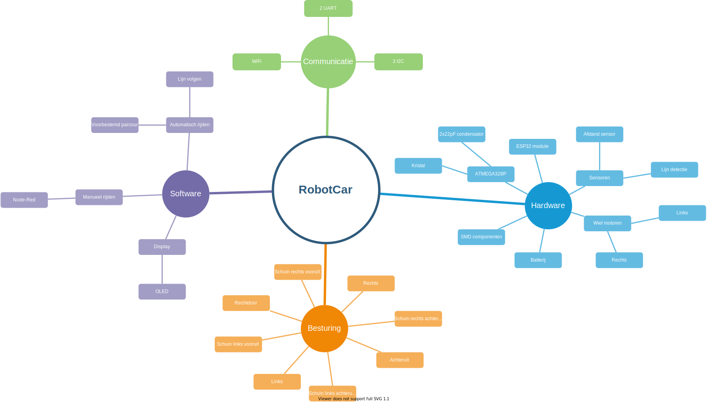

# SmartSystemsCarProject

## Analyse

### Probleemstelling

Het doel van deze opdracht is om de huidige robotwagen te verbeteren. Het volledige systeem moet opnieuw worden geanalyseerd en ontworpen met in het achterhoofd houdende dat dit op een zo goedkoop mogelijke manier wordt gedaan. 

De wagen moet voldoen aan volgende vereisten: 

- 2 UART connectoren
- 3  I2C connectoren
- De regelaar 7805 in de oude sturing vervangen door een LDL1117 (5V) en een LDL1117(3,3V)
- Polariteitsbeveiliging 
- Motordriver in de oude sturing vervangen door een SMD-type
- OLED-scherm met I2C-sturing voorzien op het bordje
- Lijnsensor
- IR-afstandssensor
- Ultrasoon afstandsensor
- ESP32 wroom + ATMega328P
- USB-C aansluiting

Om een volledig zelfstandig systeem te kunnen hebben moeten er ook een aantal verkeerssignalisaties worden ontwikkeld. Verkeerslichten en slagbomen zullen dienen om de software van de wagen te kunnen testen.

### Mind map

 

### Hardware analyse

Er worden twee afstand sensoren voorzien. Een IR afstand sensor voor de korte afstanden tot 80cm en een ultrasoon sensor voor de afstanden tot 5m. Door hier twee afstand sensoren te voorzien is er een extra zekerheid dat de juiste afstand wordt gemeten indien één van de twee sensoren geen waarde meet. De IR sensor is namelijk ook gevoelig aan zonlicht waardoor deze dan afwijkende waarden zal meten. 

##### Specificatie tabel

| Blok                      | Voltage | Stroom    |
| ------------------------- | ------- | --------- |
| Batterij                  | 7.2V    | min 700mA |
| ATMega328P                | 5V      |           |
| ESP32 Wroom-32            | 3.3V    |           |
| Motor driver  LA6583MC-AH | max 14V | 800mA     |
| IR afstandsensor          | 5V      |           |
| Ultrasoon sensor          | 5V      | max 2mA   |
| OLED                      | 5V      |           |
| CP2102N-A02-GQFN28        | 3.3V    |           |

##### Argumentatie van de verschillende blokken.

| Blok                       | Argumentatie                                                                                                                                                                                                                                                                                                                                                                                                                                                                                                                                                                                                                              | Alternatieven                    |
| -------------------------- | ----------------------------------------------------------------------------------------------------------------------------------------------------------------------------------------------------------------------------------------------------------------------------------------------------------------------------------------------------------------------------------------------------------------------------------------------------------------------------------------------------------------------------------------------------------------------------------------------------------------------------------------- | -------------------------------- |
| Motor driver  LA6583MC-AH  | Er is voor deze motor driver gekozen omdat dit een SMD component is die relatief goedkoop is. Het nadeel is dat deze maar één motor kan aansturen en er hier dus twee van nodig zijn om de robot car te laten rijden.                                                                                                                                                                                                                                                                                                                                                                                                                     |                                  |
| ESP32 wroom-32             | De ESP32-wroom-32 wordt gebruikt en niet de dev kit omdat er hierdoor meer plaats kan bespaard worden op het pcb bord en kan gekozen worden hoe het bordje zal worden ingedeeld.                                                                                                                                                                                                                                                                                                                                                                                                                                                          | ESP32 dev kit                    |
| IR afstandsensor GP2Y0A21  | Er is gekozen voor de 2y0a21 omdat er hier verschillende van aanwezig zijn in het labo en deze niet moeten besteld worden. Een alternatief zou de short range versie zijn maar zoals de naam het al zegt kan deze niet zo ver meten (max 30cm).                                                                                                                                                                                                                                                                                                                                                                                           | Short Range - Sharp GP2Y0A41SK0F |
| Ultrasoon sensor (hc sr04) | Er wordt gekozen voor de hc sr04 omdat deze tijdens de lessen arduino programming al aan bod is gekomen en deze op school al aanwezig is.                                                                                                                                                                                                                                                                                                                                                                                                                                                                                                 |                                  |
| Lijnsensor                 | De lijnsensor is een 8 Channel Track Line Detection Track IR Photoelectric Sensor. Deze is reeds beschikbaar op school.                                                                                                                                                                                                                                                                                                                                                                                                                                                                                                                   |                                  |
| OLED SSD1306 128x64        | Er wordt gekozen voor de 128x64 omdat deze iets groter is dan de 128x32 en niet veel verschilt in prijs. Tijdens de analyse was dit een verschil van 30 cent (https://protosupplies.com/?s=ssd1306+128x&post_type=product). Dit iets grotere bordje maakt dat zaken duidelijker kunnen worden afgebeeld. Daarnaast kan het I2C adres worden aangepast terwijl dit bij de kleinere versie niet mogelijk is. Indien men toch voor de 128x32 versie wil gaan is dit geen probleem aangezien deze dezelfde aansluitingen heeft als de 128x64 versie. De 128x64 bordjes zijn op school ook beschikbaar dus moeten niet meer worden aangekocht. | SSD1306 128x32                   |

##### Schema + PCB ESP32

##### Schema + PCB ATMEGA328P

### Software analyse

Het gehele systeem zal geprogrammeerd worden via de ESP32-Wroom-32. Op dit bordje is er een USB-C aansluiting voorzien. Via de ESP32-Wroom zal dan de ATMEGA328P worden geprogrammeerd die de verschillende sensoren data verzamelt en deze informatie doorspeelt aan de ESP32-Wroom. Dit kan gaan van, indien in automatische modus, de snelheid te verminderen tot de rijrichting aan te passen. 

| Blok             | Data In                               | Data Uit                                       |
| ---------------- | ------------------------------------- | ---------------------------------------------- |
| Motor driver     | PWM signaal                           | PWM signaal                                    |
| ATMega328P       | Configuratie instellingen, sensordata | Configuratie instellingen sensoren, sensordata |
| ESP32-Wroom-32   | Configuratie instellingen             | 2x PWM signaal, configuratie instellingen      |
| IR afstandsensor | Analoge data                          | Analoge data                                   |
| Ultrasoon sensor | Analoge data                          | Analoge data                                   |
| Lijnsensor       | Digitale data                         | Digitale data                                  |
| OLED             | Tekst                                 | N.V.T.                                         |

##### State diagram

Er zullen drie modi aanwezig zijn waar tussen de gebruiker kan wisselen.

- De eerste modus is de manuele modus. Hierin kan de gebruiker aan de hand van zijn smartphone en NodeRed de auto laten rijden in de gewenste richting. Zijnde vooruit, achteruit, links, rechts en de schuine zijden. De gebruiker heeft ook zelf in de hand hoe snel de wagen rijdt. 
- De tweede modus is de 'lijn volgen' modus. Hierbij zal de wagen, aan de hand van zijn linetracker, een lijn volgen en hier niet van afwijken. Indien er tijd over is zal de wagen ook tegelijkertijd gebruik maken van de afstand sensoren om zijn snelheid aan te passen of te stoppen zodat deze niet botst. 
- De derde modus is de modus waarin de wagen een op voorhand geprogrammeerd parcour volgt. Dit parcour zal de verschillende handelingen, die de wagen kan uitvoeren, gebruiken om zo als toon model in te staan zodat omstaanders kunnen zien wat de wagen kan. 

##### Flow chart

##### Planning

De planning ziet er als volgt uit. We beginnen met de probleemstelling uit te schrijven en een mind map te maken. Zo krijgen we een duidelijk overzicht van wat er moet gebeuren en in welke volgorde we alles gaan aanpakken.
Na de probleemstelling en mindmap te hebben gemaakt kunnen we beginnen aan de hardware- en software analyse. Dit zal toch een kleine maand in beslag nemen. Vervolgens kunnen we beginnen aan het PCB design. Dit gaat wel een langere tijd in beslag nemen omdat onze eerste versie zeker niet direct de juiste gaat zijn. Er zullen verschillende iteraties over gaan tegen dat we de zo goed mogelijke PCB hebben gemaakt. Telkens dat we een versie hebben afgemaakt gaan we deze bestukken en testen. Zo kunnen we te weten komen of alles werkt en of er nog veranderingen moeten gebeuren. Als laatste gaan we de code schrijven en testen. 
Door het hele proces gaan we alles documenteren. 

