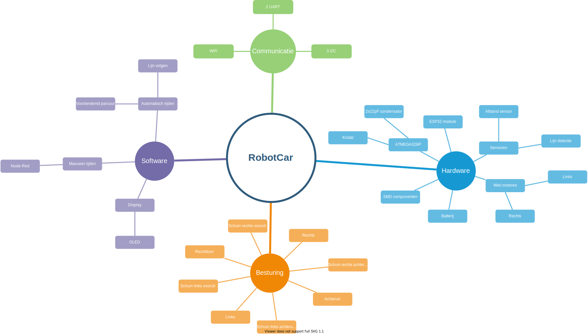

# SmartSystemsCarProject

## Analyse

### Probleemstelling
Het doel van deze opdracht is om de huidige robotwagen te verbeteren. Het volledige systeem moet opnieuw worden geanalyseerd en ontworpen met in het achterhoofd houdende dat dit op een zo goedkoop mogelijke manier wordt gedaan. 

De wagen moet voldoen aan volgende vereisten: 

- 2 UART connectoren
- 3  I2C connectoren
- De regelaar 7805 in de oude sturing vervangen door een LDL1117 (5V) en een LDL1117(3,3V)
- Polariteitsbeveiliging 
- Motordriver in de oude sturing vervangen door een SMD-type
- OLED-scherm met I2C-sturing voorzien op het bordje
- Linetracker
- IR-afstandssensor
- Ultrasoon afstandsensor
- ESP32 module + ATMega328P

Om een volledig zelfstandig systeem te kunnen hebben moeten er ook een aantal verkeerssignalisaties worden ontwikkeld. Verkeerslichten en slagbomen zullen dienen om de software van de wagen te kunnen testen.

https://arduinogetstarted.com/tutorials/arduino-oled

### Mind map

 

### Hardware analyse 

Er worden twee afstand sensoren voorzien. Een IR afstandssensor voor de korte afstanden tot 80cm en een ultrasoon sensor voor de afstanden tot 5m. Door hier twee afstand sensoren te voorzien is er een extra zekerheid dat de juiste afstand wordt gemeten indien één van de twee sensoren geen waarde meet. De IR sensor is namelijk ook gevoelig aan zonlicht waardoor deze dan afwijkende waarden zal meten. 

Daarnaast is er gekozen om gebruik te maken van de ESP32 dev kit en geen afzonderlijke ESP32. In de dev kit zit al een 3.3V regelaar waardoor deze niet moet voorzien worden op de pcb.

| Blok | Voltage | Stroom |
|------|---------|----------|
| Batterij| 7.2V | min 700mA|
| ATMega328P| 5V | |
|ESP32 dev kit| 5V | 128mA|
| Motor driver | | |
|IR afstandsensor | | | 
|Ultrasoon sensor | 5V| max 2mA|
|OLED | 5V | | 

hfd

|Blok | Argumentatie | Alternatieven |
|------|---------|----------|
| Motor power| | | 
| ESP32 dev kit | | |
| IR afstandsensor | | | 
| Ultrasoon sensor (hc sr04) | Er wordt gekozen voor de hc sr04 omdat deze tijdens de lessen arduino programming al aan bod is gekomen en deze op school al aanwezig is. | | 
| Lijnsensor | De lijnsensor is |  |
| OLED SSD1306 128x64| Er wordt gekozen voor de 128x64 omdat deze iets groter is dan de 128x32 en niet veel verschilt in prijs. OP moment van analyse was dit een verschil van 30 cent op https://protosupplies.com/?s=ssd1306+128x&post_type=product. Dit iets grotere bordje maakt dat zaken duidelijker kunnen worden afgebeeld. Daarnaast kan het I2C adres worden aangepast terwijl dit bij de kleinere versie niet mogelijk is. Indien men toch voor de 128x32 versie wil gaan is dit geen probleem aangezien deze dezelfde aansluitingen heeft als de 128x64 versie.| SSD1306 128x32|

### Software analyse

